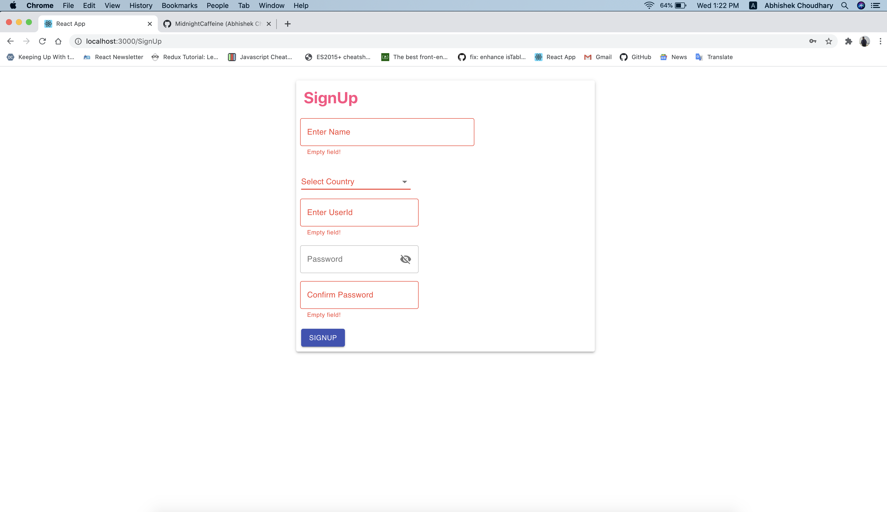
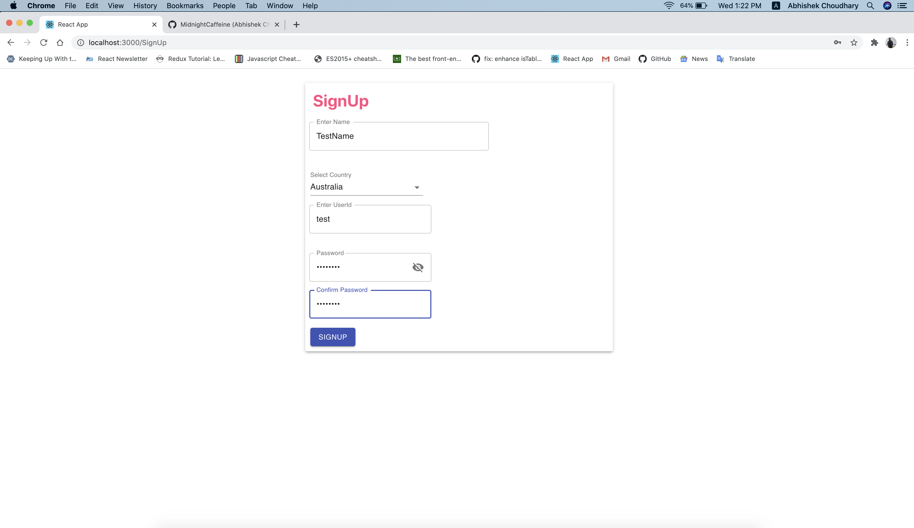
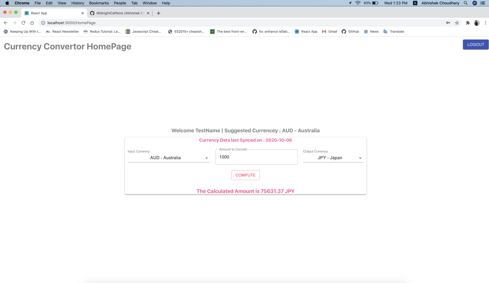

## React Redux Hooks Example (Currency converter app)

* This is a second part of our application.
* In the first part [REPO] (https://github.com/MidnightCaffeine/react_router_hooks_ex) we created currency convertor using only react with hooks.
* This is created using react and redux hooks
* Uses react router for navigation.
* Contains Login SignUp and Homepage, relevant state are maintained through redux.
* Basic validation check has been applied in signup and login.
* UI elements used using material UI.
* Some inline styles are there. (to be moved to scss)
-------------------------------------
* From login page you need to signup. Once signup done you can login.
* After login it lands to HomePage. Which is a basic currency converter,
* Takes input currency, amount to be converted and output currency from user.
* Uses Currency Convertor [API] (https://api.exchangeratesapi.io/latest)
* Logut Button to route back to login page.
* Contains basic validation in all pages.

## Some Screenshot from the app 

#### Signup
#### Login
#### HomePage
---------------------------------------

---------------------------------------

---------------------------------------

---------------------------------------

---------------------------------------

This project was bootstrapped with [Create React App](https://github.com/facebook/create-react-app).

## Available Scripts

In the project directory, you can run:

### `npm start`

Runs the app in the development mode. 
Open [http://localhost:3000](http://localhost:3000) to view it in the browser.

The page will reload if you make edits. 